[//]: # (<a href="#">)

[//]: # ()
[//]: # (  )

[//]: # ()
[//]: # (</a>)

- 🌱 I’m currently learning: AI, Reverse, JavaScrip
- 👯 I’m building
  on: [wechatDownload](https://github.com/qiye45/wechatDownload), [wechatVideoDownload](https://github.com/qiye45/wechatVideoDownload)
- 💬 Ask me about: [changfeng](https://t.me/changfengbox)

## 🌟 **My Skills**  

 

[//]: # (![]&#40;https://img.shields.io/badge/-React-2d98ce?style=flat-square&logo=React&logoColor=fff&#41;)
<!--START_SECTION:waka-->

## 🌍 **Environment**

## 🎮 Playing **Games**

- The Witcher 3: Wild Hunt
- Detroit: Become Human
- Stardew Valley
- ...

  

  
  
  

[//]: # ()
[//]: # (  )

